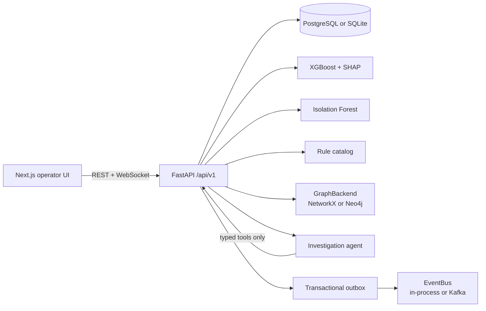

# RazorGuard X

**Agentic Real-Time Payment Fraud & Fraud-Ring Intelligence Platform**

Independent student prototype for a Razorpay AI Builder Internship application. **Not a Razorpay product. Not affiliated with Razorpay.** Not a production payment or fraud-prevention system. All live traffic is synthetic.

---

## Overview

RazorGuard X scores a synthetic payment, explains the decision, and opens a tool-grounded investigation when risk is high. The operator can record feedback and inspect drift without rewriting historical scores.

```
Transaction
  → Feature Enrichment
  → XGBoost Fraud Risk
  → Isolation Forest Behavioral Anomaly
  → Deterministic Rules
  → Fraud Graph Intelligence
  → Final Risk Score
  → APPROVE / REVIEW / BLOCK
  → AI Investigation Agent
  → Evidence + Investigation Report
  → Human Feedback
```

The AI investigation agent does not determine fraud probability. The risk engine owns fraud scoring and decisioning; the agent synthesizes tool-grounded evidence and recommends an investigation outcome.

---

## Public demo

Independent student prototype. Synthetic traffic only.

| Surface | URL |
| --- | --- |
| Operator UI | https://razorguard-x.vercel.app |
| API | https://razorguard-x-api.onrender.com |

Production uses Render FastAPI + Render Postgres + Vercel Next.js. Events are in-process; graph is NetworkX; investigator is deterministic fallback (`LLM_PROVIDER=none`). See `DEPLOYMENT.md`.

Cloud login: `admin@razorguard.local` plus the Render seed password (not the lab password below).

---

## Key capabilities

- Real-time transaction risk scoring (FastAPI)
- XGBoost supervised score + optional isotonic calibration
- Isolation Forest behavioral anomaly + interpretable user checks
- SHAP explanations
- Deterministic fraud rule catalog
- Fraud-ring graph intelligence (NetworkX default, optional Neo4j persistence)
- Kafka event streaming (optional) with transactional outbox, retries, DLQ, and idempotency
- AI investigation agent: local Ollama / Llama 3.1 8B (or any OpenAI-compatible API), native tool calls, deterministic fallback
- Human analyst feedback (`CONFIRM_FRAUD` / `CONFIRM_LEGITIMATE` / `NEEDS_REVIEW`)
- PSI drift monitoring and a model registry (candidates stay offline)
- Offline ULB and IEEE-CIS public-dataset evaluation tracks
- Next.js operator UI + Docker Compose lab stack

---

## Architecture



Scoring is synchronous. Domain events are written to the outbox in the same database transaction, then published after commit. See `docs/architecture.md`.

---

## Screens

| Page | Route | What it shows |
| --- | --- | --- |
| Dashboard | `/` | Command-floor totals and recent scored payments |
| Live Transactions | `/transactions` | Live wire of scored traffic |
| Transaction detail | `/transactions/[id]` | Scores, rules, SHAP, graph evidence |
| Case files | `/investigations` | Investigation list |
| Investigation | `/investigations/[id]` | Tool-grounded report + analyst feedback |
| Fraud graph | `/fraud-network` | Entity graph / clusters |
| Analytics / Telemetry | `/analytics` | Synthetic live-model metrics |
| Simulation | `/simulation` | Named attack-scenario generator |
| Monitoring | `/monitoring` | Drift PSI, feedback counts, model registry |
| Scenario eval | `/scenario-eval` | Synthetic catch-rate lab (not ULB) |
| Model bay / System | `/system` | Health, graph backend, event bus |
| IEEE-CIS | `/ieee-eval` | Offline public-dataset evaluation |

---

## Engineering highlights

**Risk pipeline.** Every payment goes through enrichment, XGBoost, Isolation Forest, rules, and graph features, then a weighted combiner (`WEIGHT_*`, `THRESHOLD_*`). Cutoffs are prototype experiments, not industry standards.

**Graph.** `GraphBackend` is a protocol. Default is in-process **NetworkX** (rebuilt from SQL on boot). Optional **Neo4j** persistence (`GRAPH_BACKEND=neo4j`) was verified for fraud-ring scoring and survival across a FastAPI-only restart. See `docs/graph-backend.md`.

**Events.** Typed domain events (`transaction-created`, `risk-scored`, investigation, alert, feedback, drift) use a transactional **outbox**, background drain, optional **Kafka**, consumer idempotency, retries, and a DLQ. Kafka event streaming and transactional outbox were end-to-end verified against a live single-broker Kafka environment. This is **not** a production-ready Kafka deployment. Default remains `EVENT_BUS=inprocess`. See `docs/event-driven-architecture.md`, `docs/transactional-outbox.md`, `docs/kafka-verification.md`.

**Agent.** Closed tool registry, Pydantic arguments, redaction, and grounding that copies the risk-engine probability. No arbitrary SQL, filesystem, shell, or HTTP. See `docs/llm-investigation-agent.md`.

---

## ML evaluation

Three tracks. **Do not mix their metrics.**

| Track | What it is | What it is not |
| --- | --- | --- |
| LIVE / PRODUCT-STYLE | Synthetic payments scored by `xgb-iforest-v1-calibrated` | Production fraud accuracy |
| ULB (REAL_DATASET) | Offline chronological holdout of the public credit-card CSV | Live scores or Razorpay data |
| IEEE-CIS | Offline chronological candidates under `ml/models/ieee/` | Live scoring |

**ULB (offline):** PR-AUC = 0.7579, ROC-AUC = 0.9830

**IEEE-CIS (offline, frozen calibrated test):** PR-AUC = 0.33715, ROC-AUC = 0.86884

These are offline benchmark results on public datasets and should not be interpreted as production fraud-detection accuracy.

Reports: `ml/evaluation/ulb_report.md`, `ml/evaluation/ieee_results.md`, `docs/ml.md`, `docs/ieee-cis-evaluation.md`.

---

## LLM architecture

- Provider abstraction (`LLM_PROVIDER`): OpenAI-compatible Chat Completions **or** none
- Local option: Ollama + Llama 3.1 8B (`LLM_BASE_URL` pointing at the local server)
- Native tool calls against a **closed** registry
- Deterministic fallback when no key is set or the provider fails
- Grounding copies `ml_probability` / engine decision from `get_model_explanation`
- Redaction of secrets in logs and stored reports
- No arbitrary SQL, filesystem, shell, or outbound HTTP from the agent

Leave `LLM_PROVIDER=none` to run without an LLM.

---

## Event architecture

```
Transaction
  → DB transaction (risk row + outbox row)
  → commit
  → outbox worker
  → EventBus (in-process or Kafka)
  → consumer (idempotent)
  → alert / investigation side effects
```

Correlation IDs travel on `X-Correlation-ID`. Failed handler attempts go to `failed_events` and `events-dlq`. Duplicate deliveries are skipped.

---

## Graph architecture

- **NetworkX** — default local backend, no extra services
- **Neo4j** — optional persistent backend (`NEO4J_URI`, credentials in `.env` only)
- `GRAPH_NEO4J_FALLBACK=true` falls back to NetworkX if Neo4j is down
- Ring heuristics look for shared devices/IPs and flagged neighbors. A cluster is a **potential** ring, not a confirmed fraud label

---

## Security

Lab controls, not a production control plane:

- JWT access tokens (HS256). Production environment refuses placeholder secrets
- RBAC: ADMIN, RISK_ANALYST, INVESTIGATOR, VIEWER
- Pydantic validation on write payloads
- SlowAPI rate limiting
- CORS allow-list (`CORS_ORIGINS`)
- Audit logs for ingest, scoring, investigations, feedback
- `.env` gitignored; `.env.example` has names and placeholders only
- Agent/tool output redaction
- No real card data — payment identifiers are synthetic tokens

Details: `docs/security.md`.

---

## Local setup

Requires Python **3.11 or 3.12** (3.14 is not supported by current dependencies) and Node.js 18+.

```bash
cp .env.example .env
```

### Backend

```bash
cd backend
python3.12 -m venv .venv
source .venv/bin/activate
pip install -r requirements.txt
export PYTHONPATH=.
uvicorn app.main:app --host 127.0.0.1 --port 8000
```

Equivalent helper (uses whatever `uvicorn` is on `PATH`):

```bash
./scripts/dev-backend.sh
```

On first boot the API creates tables, loads `ml/models/` (`xgb-iforest-v1-calibrated`), and seeds demo users if the user table is empty.

Health: [http://127.0.0.1:8000/api/v1/health](http://127.0.0.1:8000/api/v1/health) · OpenAPI: [http://127.0.0.1:8000/docs](http://127.0.0.1:8000/docs)

### Frontend

```bash
cd frontend
npm install
npm run dev
```

Or `./scripts/dev-frontend.sh`.

Open [http://localhost:3000/login](http://localhost:3000/login).

Browser env (safe to expose):

| Variable | Default |
| --- | --- |
| `NEXT_PUBLIC_API_URL` | `http://localhost:8000` |
| `NEXT_PUBLIC_WS_URL` | `ws://localhost:8000` |

### Demo seed accounts

Lab-only. Production environment refuses this password.

| Email | Role | Password |
| --- | --- | --- |
| admin@razorguard.local | ADMIN | prototype-pass |
| analyst@razorguard.local | RISK_ANALYST | prototype-pass |
| investigator@razorguard.local | INVESTIGATOR | prototype-pass |
| viewer@razorguard.local | VIEWER | prototype-pass |

### Docker Compose

```bash
docker compose up --build
```

- UI: http://localhost:3000
- API: http://localhost:8000
- Postgres: localhost:5432
- Redis: localhost:6379
- Neo4j (optional): localhost:7474 / 7687
- Kafka (optional): localhost:9092 — app default is still `EVENT_BUS=inprocess`

```bash
# Optional Kafka transport (falls back to in-process if the broker is down)
EVENT_BUS=kafka EVENT_BUS_FALLBACK=true docker compose up --build

# Optional outbox/consumer process
docker compose --profile workers up --build
```

### Neo4j

Set in `.env` (not committed):

```
GRAPH_BACKEND=neo4j
GRAPH_NEO4J_FALLBACK=false
NEO4J_URI=bolt://localhost:7687
NEO4J_USERNAME=neo4j
NEO4J_PASSWORD=
```

Compose default auth is documented in `docker-compose.yml` via `NEO4J_AUTH`. Put the password only in local `.env`.

### Kafka

Default is in-process. To use the lab broker: `EVENT_BUS=kafka`, `KAFKA_BOOTSTRAP_SERVERS=localhost:9092`. See `docs/kafka-verification.md`.

### Ollama (optional LLM)

```
LLM_PROVIDER=openai
LLM_MODEL=llama3.1:8b
LLM_BASE_URL=http://127.0.0.1:11434/v1
LLM_API_KEY=ollama
```

`LLM_API_KEY=ollama` is a dummy value some Ollama OpenAI-compatible servers expect. It is not a cloud credential.

---

## Testing

```bash
cd backend
python3.12 -m venv .venv
source .venv/bin/activate
pip install -r requirements.txt
PYTHONPATH=. pytest -q

cd ../frontend
npm test
```

Executed for this repository (2026-09-05, `backend/.venv` Python 3.12.9):

| Suite | Result |
| --- | --- |
| Backend `pytest -q` | **162 passed, 12 skipped** (opt-in Kafka + Neo4j integrations skipped) |
| Frontend `npm test` (Vitest) | **5 passed** (2 files) |

Opt-in integrations (need running services):

```bash
RUN_KAFKA_TESTS=1 PYTHONPATH=. pytest tests/test_kafka_integration.py -q
RUN_NEO4J_TESTS=1 PYTHONPATH=. pytest tests/test_graph_phase4.py -q
```

---

## Repository structure

```
backend/          FastAPI app, Alembic, pytest
frontend/         Next.js operator UI
ml/data/          Dataset layout + download/preprocess scripts (raw CSVs gitignored)
ml/models/        Live product artifacts + offline ULB/IEEE metadata
ml/training/      Train/eval scripts (synthetic, ULB, IEEE)
ml/evaluation/    Offline reports and figures
ml/ulb/           ULB adapter
docs/             Architecture, API, agent, graph, Kafka, ML
scripts/          Local backend/frontend helpers
docker-compose.yml
DEPLOYMENT.md     Render + Vercel public demo (no secrets)
render.yaml
.env.example
```

---

## Environment

See `.env.example`. Important names only:

- `DATABASE_URL`, `REDIS_URL`, `SECRET_KEY`, `CORS_ORIGINS`
- `WEIGHT_*`, `THRESHOLD_*`
- `GRAPH_BACKEND`, `NEO4J_*`
- `EVENT_BUS`, `KAFKA_*`, `OUTBOX_*`
- `LLM_PROVIDER`, `LLM_API_KEY`, `LLM_MODEL`, `LLM_BASE_URL`
- `NEXT_PUBLIC_API_URL`, `NEXT_PUBLIC_WS_URL`

Never commit `.env`.

---

## Limitations

- Independent student prototype — not a Razorpay product and not production-ready
- Live scores are synthetic; ULB / IEEE numbers are offline public-dataset benchmarks
- Local LLM is optional; default investigator is deterministic
- Kafka and Neo4j need extra local infrastructure; they are optional
- Dockerized backend/event-worker with `EVENT_BUS=kafka` was **not** verified as a container pair
- First public cloud deploy uses Render + Vercel with in-process events and NetworkX (see `DEPLOYMENT.md`). Kafka/Neo4j/Ollama are not claimed in production unless separately verified
- No GNN, feature store, online learning, real cards, or bank APIs
- Default JWT secret and seed password are lab-only; production Render refuses `prototype-pass`

---

## Public demo

Cloud URLs are recorded here only after a real deploy succeeds. Until then use local setup above.

- Blueprint: `render.yaml`
- Steps: `DEPLOYMENT.md`

---

## License

No license file is included yet. Treat the code as source-available for review unless a license is added. An MIT license is a reasonable default for an internship portfolio if you want others to run it.

Educational use only. Do not deploy as a live payment-risk control. Do not claim Razorpay affiliation or certified accuracy.
